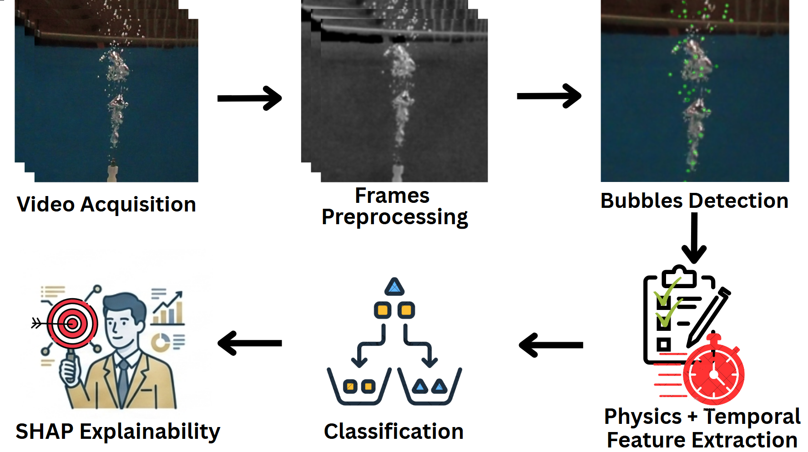
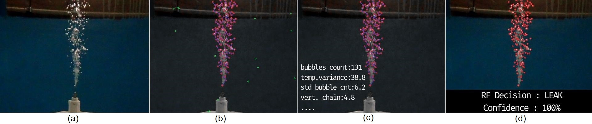
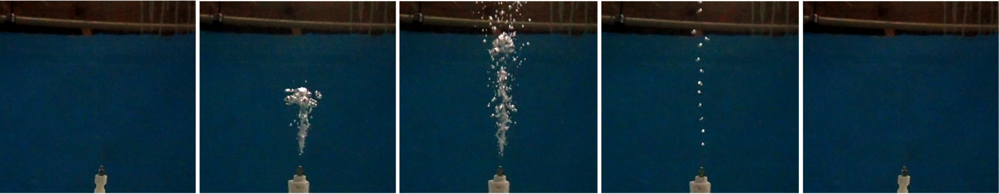
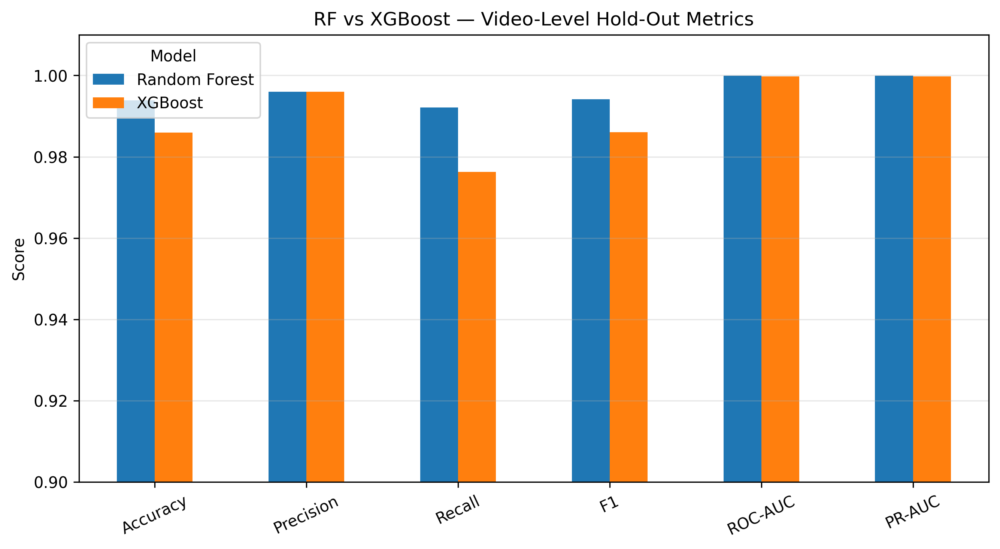
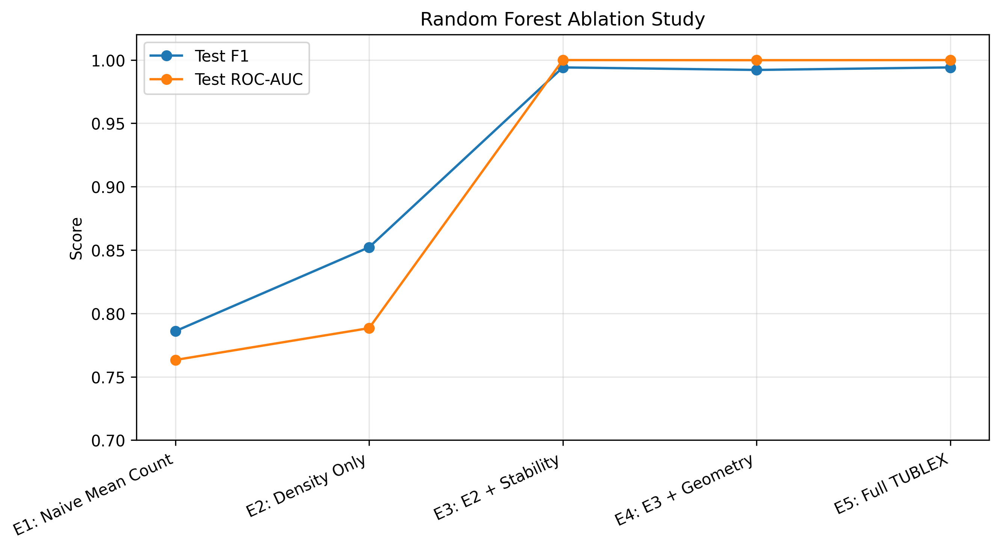
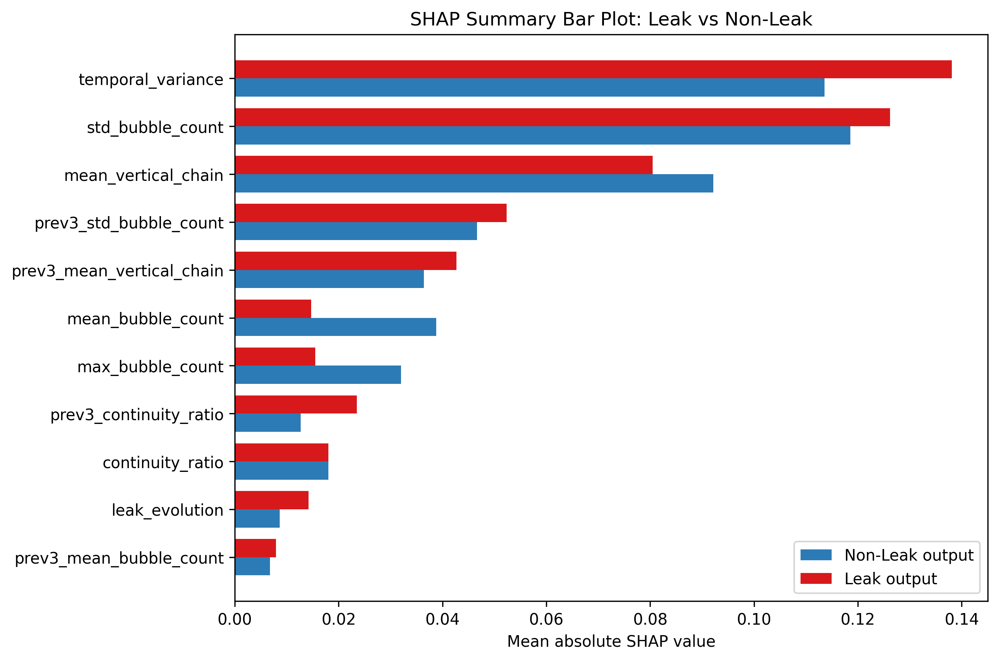
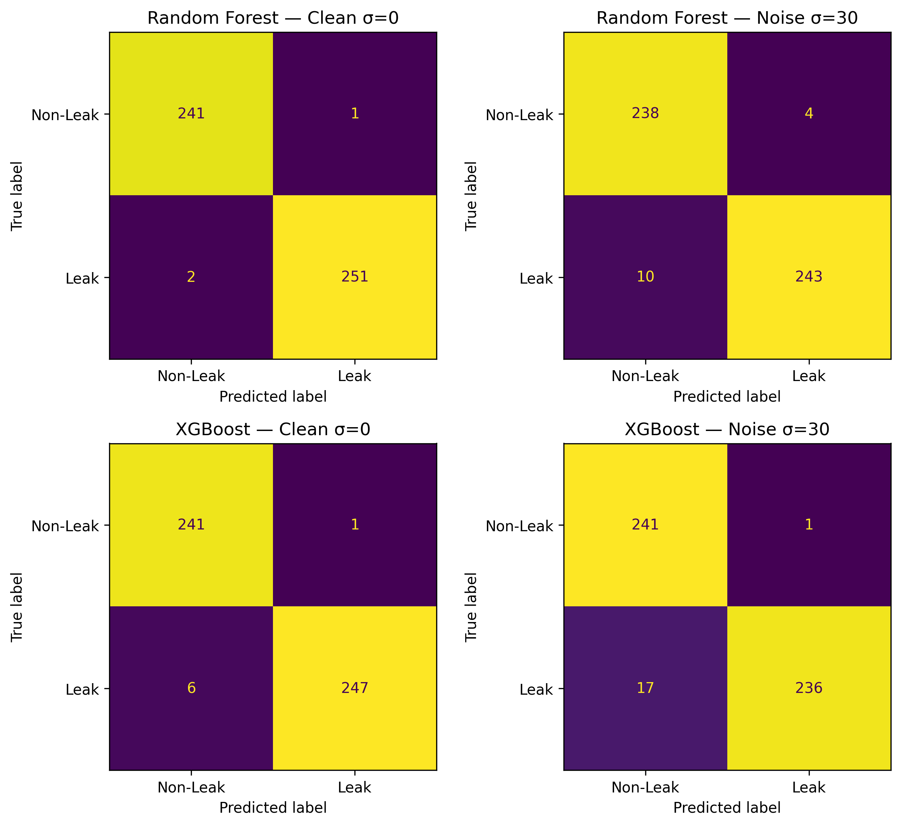

<div align="center">

# TUBLEX Bubble Plume Analysis

### Explainable Physics-Inspired Bubble Plume Analysis for Real-Time Underwater Gas Leak Detection

**Physics-Inspired Features • Underwater Bubble Monitoring • Random Forest • XGBoost Baseline • SHAP Explainability**

[](https://python.org)
[](#models)
[](#models)
[](#explainability)
[](https://www.kaggle.com/datasets/ghitrihamza/tublex-bubble-plume-window-feature-dataset)
[](#citation)
[](LICENSE)

<br/>

★ [IEEE Paper](#) &nbsp;·&nbsp;
★ [Kaggle Dataset](https://www.kaggle.com/datasets/ghitrihamza/tublex-bubble-plume-window-feature-dataset) &nbsp;·&nbsp;
★ [NeptuNet Framework](https://github.com/7amzaGH/NeptuNet-AUV-Intelligent-System) &nbsp;·&nbsp;

<br/>

Lightweight temporal bubble-plume monitoring for interpretable underwater gas leak early warning.

<br/>


</div>

---

## Table of Contents

- [Overview](#overview)
- [System Architecture](#system-architecture)
- [Dataset](#dataset)
- [Bubble Feature Extraction](#bubble-feature-extraction)
- [Models](#models)
- [Results](#results)
- [Explainability](#explainability)
- [Noise Robustness](#noise-robustness)
- [Quick Start](#quick-start)
- [Usage in Python](#usage-in-python)
- [Notebook Demo](#notebook-demo)
- [C++ Embedded Runtime Skeleton](#c-embedded-runtime-skeleton)
- [Repository Structure](#repository-structure)
- [Role within NeptuNet](#role-within-neptunet)
- [Citation](#citation)
- [Acknowledgments](#acknowledgments)
- [License](#license)

---

## Overview

Reliable underwater gas leak detection is challenging because bubble activity can appear sparse, unstable, noisy, or visually similar to non-leak disturbances. Single-frame observations are often not enough to distinguish persistent leak-like plume behavior from isolated bubbles or background artifacts.

**TUBLEX** addresses this problem using a lightweight temporal feature-based approach. Instead of relying only on frame-level bubble detections, the pipeline analyzes short **one-second windows** of underwater video and converts each window into physics-inspired bubble plume descriptors.

The framework combines:

- **adaptive underwater preprocessing**
- **bubble candidate detection and spatial filtering**
- **one-second temporal windowing**
- **physics-inspired feature extraction**
- **Random Forest leak-suspicion classification**
- **XGBoost baseline comparison**
- **SHAP-based explainability**

TUBLEX outputs an interpretable leak-suspicion probability for each temporal window. The selected model is a **Random Forest classifier**, chosen for its strong held-out performance and more interpretable confidence behavior on real-world out-of-domain footage.

This project focuses on **bubble-based leak-suspicion monitoring** using temporal plume descriptors. Final plume segmentation, leak-source localization, and robotic system integration are handled outside the scope of this repository.
  
---

## System Architecture

<p align="center">
  
</p>

TUBLEX converts underwater bubble activity into compact temporal descriptors for leak-suspicion classification.

The pipeline operates in five main stages:

### 1. Underwater Frame Preprocessing

Input frames are enhanced using adaptive preprocessing to improve bubble visibility under different underwater lighting and contrast conditions.

### 2. Bubble Candidate Detection

Bubble-like regions are detected from the preprocessed frames using lightweight image-processing operations.

### 3. Spatial Filtering

Detected candidates are filtered to reduce isolated artifacts and retain bubble activity that is more consistent with plume-like behavior.

### 4. Temporal Windowing

Frames are grouped into fixed **one-second windows**. Each window summarizes short-term bubble dynamics rather than relying on a single frame.

### 5. Leak-Suspicion Classification

Physics-inspired window descriptors are passed to a tree-based classifier to estimate leak-suspicion probability.

```text
Underwater video
        ↓
Adaptive preprocessing
        ↓
Bubble candidate detection
        ↓
Spatial filtering
        ↓
One-second temporal windowing
        ↓
Physics-inspired descriptors
        ↓
Random Forest / XGBoost classification
        ↓
Leak-suspicion probability
```

### End-to-End Pipeline Example

The figure below shows a representative TUBLEX inference output for a leak window, from raw underwater imagery to bubble detection, feature extraction, and final Random Forest decision.

<p align="center">
  
</p>

<p align="center">
  <sub>
    End-to-end pipeline output for a representative leak window.
    (a) Raw input frame.
    (b) Preprocessed frame with blob detection.
    (c) Spatially filtered bubbles with DBSCAN and feature extraction.
    (d) Classification output on the original frame.
  </sub>
</p>

---

## Dataset

The TUBLEX dataset is provided as a processed window-level feature dataset for underwater bubble plume analysis.

The public dataset is available on Kaggle:

<p align="center">
  <a href="https://www.kaggle.com/datasets/ghitrihamza/tublex-bubble-plume-window-feature-dataset">
    
  </a>
</p>

The dataset contains derived **one-second temporal bubble plume features**, not raw video files. Each row represents a fixed one-second window extracted from underwater bubble plume videos and described using physics-inspired TUBLEX descriptors.

### Data Origin

The original source videos come from the GRIIDC dataset:

**Lu, Zhiqu. 2023. _Videos of a laboratory study to simulate hydrocarbon leakages and their induced sound_. Distributed by: GRIIDC, Harte Research Institute, Texas A&M University–Corpus Christi. DOI: [10.7266/BZY62EK0](https://doi.org/10.7266/BZY62EK0). UDI: `S3.x911.000:0005`.**

The original GRIIDC dataset contains laboratory videos of simulated hydrocarbon leakage processes. This repository and the Kaggle dataset provide the derived machine-learning-ready TUBLEX feature tables used for leak-suspicion classification experiments.

### Processing Scale

The feature dataset was created through frame-level processing before temporal aggregation. The full extraction workflow handled **86,110 video frames**, corresponding to **8,611 seconds** of underwater video at 10 FPS.

After filtering and dataset curation, the final TUBLEX feature table contains **2,504 one-second windows**, corresponding to **25,040 analyzed frame observations** used for the final machine learning dataset.

| Processing Stage | Quantity |
|---|---:|
| Total processed frames | 86,110 |
| Total candidate one-second windows | 8,611 |
| Final retained windows | 2,504 |
| Final retained frame observations | 25,040 |
| Sampling rate | 10 FPS |
| Window duration | 1 second |

### Visual Example of Leak Development

The dataset was generated from frame-level analysis of underwater bubble activity. The example below illustrates the temporal development of a leak-like bubble plume before aggregation into one-second TUBLEX windows.

<p align="center">
  
</p>

### Dataset Summary

| Item | Value |
|---|---:|
| Final window samples | 2,504 |
| Source videos | 85 |
| Model features | 11 |
| Window duration | 1 second |
| Classification labels | Leak / Non-leak |
| Split protocol | Video-level train/test split |
| Noise variants | σ = 10, σ = 20, σ = 30 |

### Dataset Files

```text
data/
├── processed/
│   └── tublex_window_features.csv
│
├── metadata/
│   └── tublex_video_metadata.csv
│
├── splits/
│   └── tublex_video_level_split_seed42.csv
│
└── noise/
    ├── tublex_video_noise_sigma10.csv
    ├── tublex_video_noise_sigma20.csv
    └── tublex_video_noise_sigma30.csv
```

### Dataset Files

The released dataset is organized into processed features, metadata, official splits, and noise-robustness variants.

| File | Description |
|---|---|
| `processed/tublex_window_features.csv` | Main processed TUBLEX dataset. Each row is a one-second bubble plume window with extracted descriptors and a binary label. |
| `metadata/tublex_video_metadata.csv` | Video-level metadata used for traceability, condition tracking, and split management. |
| `splits/tublex_video_level_split_seed42.csv` | Official video-level train/test split used in the experiments. |
| `noise/tublex_video_noise_sigma10.csv` | Noisy feature variant used for σ = 10 robustness evaluation. |
| `noise/tublex_video_noise_sigma20.csv` | Noisy feature variant used for σ = 20 robustness evaluation. |
| `noise/tublex_video_noise_sigma30.csv` | Noisy feature variant used for σ = 30 robustness evaluation. |

The split is performed at the video level to reduce window-level leakage between training and testing.

Experimental metadata is retained for traceability and analysis, but the trained classifiers use only the extracted TUBLEX bubble descriptors as input features.

---

## Bubble Feature Extraction

TUBLEX transforms frame-level bubble observations into compact one-second temporal descriptors.

Each video is sampled at **10 FPS**, so every TUBLEX window summarizes approximately **10 frame-level observations**. Instead of making a decision from a single frame, the model uses short-term bubble behavior to capture plume persistence, instability, vertical structure, and temporal evolution.

```text
Frame-level bubble detections
        ↓
Bubble count and vertical-chain estimation
        ↓
One-second temporal aggregation
        ↓
Previous-window temporal memory
        ↓
11 TUBLEX descriptors
```

### Frame-Level Observations

For each sampled frame, TUBLEX estimates:

| Frame-Level Quantity | Description |
|---|---|
| `bubble_count` | Number of filtered bubble candidates detected in the frame. |
| `vertical_chain` | Estimated vertical bubble-chain structure in the frame. |
| `frame_has_bubbles` | Binary indicator showing whether bubbles were detected in the frame. |

These frame-level quantities are then aggregated into one-second windows.

---

### Window-Level TUBLEX Descriptors

The final model uses **11 physics-inspired descriptors**.

| Feature | Description |
|---|---|
| `mean_bubble_count` | Average bubble count across the one-second window. |
| `max_bubble_count` | Maximum bubble count observed in the window. |
| `std_bubble_count` | Bubble-count variability within the window. |
| `continuity_ratio` | Fraction of frames in the window where bubbles were detected. |
| `mean_vertical_chain` | Average vertical-chain structure across the window. |
| `temporal_variance` | Variance of bubble count across the window. |
| `prev3_mean_bubble_count` | Mean bubble count from the previous three windows. |
| `prev3_std_bubble_count` | Previous-window memory of bubble-count variability. |
| `prev3_continuity_ratio` | Previous-window memory of bubble continuity. |
| `prev3_mean_vertical_chain` | Previous-window memory of vertical-chain structure. |
| `leak_evolution` | Short-term change in bubble activity relative to previous windows. |

---

### Feature Groups

| Group | Features | Purpose |
|---|---|---|
| Density | `mean_bubble_count`, `max_bubble_count` | Measures the amount of bubble activity. |
| Stability | `std_bubble_count`, `temporal_variance`, `continuity_ratio` | Captures whether bubble activity is persistent or unstable. |
| Structure | `mean_vertical_chain` | Represents vertically organized plume-like behavior. |
| Temporal memory | `prev3_*` features | Adds short-term context from previous windows. |
| Evolution | `leak_evolution` | Measures recent change in plume activity. |

The feature design is intentionally lightweight. It avoids heavy deep-learning inference during the classification stage and allows the final leak-suspicion decision to be made from a compact structured descriptor vector.

---

## Models

TUBLEX includes two tree-based classifiers trained on the same window-level bubble plume descriptor dataset.

| Model | Role | Location |
|---|---|---|
| Random Forest | Selected TUBLEX model | `models/random_forest/` |
| XGBoost | Comparative baseline | `models/xgboost/` |

The **Random Forest** model is used as the selected TUBLEX classifier because it combines strong held-out performance with more interpretable confidence behavior on real-world out-of-domain footage.

The **XGBoost** model is included as a strong baseline to compare classification performance, probability behavior, and robustness under noisy conditions.

### Model Files

```text
models/
├── random_forest/
│   ├── rf_tublex_final.joblib
│   └── rf_tublex_metadata.json
│
└── xgboost/
    ├── xgb_tublex_final.joblib
    └── xgb_tublex_metadata.json
```

### Model Files

| File | Description |
|---|---|
| `rf_tublex_final.joblib` | Trained Random Forest classifier used as the selected TUBLEX model. |
| `rf_tublex_metadata.json` | Random Forest metadata containing model type, feature order, positive class, and decision threshold. |
| `xgb_tublex_final.joblib` | Trained XGBoost classifier used as a comparative baseline. |
| `xgb_tublex_metadata.json` | XGBoost metadata containing model type, feature order, positive class, and decision threshold. |

The metadata files are important for reproducible inference because they preserve the exact feature-column order expected by each trained model.

### Selected Model

Random Forest is selected as the final TUBLEX model for repository demos and deployment-oriented inference.

```text
TUBLEX descriptors
        ↓
Random Forest classifier
        ↓
Leak-suspicion probability
        ↓
Non-leak / Leak decision
```

The default decision threshold is: 0.50
> XGBoost remains available for benchmarking and comparison notebooks, but the Random Forest model is used in the main video demo and runtime examples.

---

## Results

The main evaluation uses a video-level held-out split to reduce window-level leakage between training and testing. Random Forest is used as the selected TUBLEX model, while XGBoost is included as a comparative baseline.

---

### Selected Random Forest Model

| Metric | Value |
|---|---:|
| Accuracy | 0.9939 |
| Precision | 0.9960 |
| Recall | 0.9921 |
| F1-score | 0.9941 |
| ROC-AUC | 0.9999 |


The selected Random Forest model achieves strong held-out performance using only the 11 TUBLEX bubble plume descriptors.

---

### Random Forest vs XGBoost

| Model | Accuracy | Precision | Recall | F1-score | ROC-AUC |
|---|---:|---:|---:|---:|---:|
| Random Forest | 0.9939 | 0.9960 | 0.9921 | 0.9941 | 0.9999 |
| XGBoost | 0.9859 | 0.9960 | 0.9763 | 0.9860 | 0.9998 |

<p align="center">
  
</p>

Both models perform strongly on the held-out test split. Random Forest is selected because it provides slightly stronger test performance and more interpretable confidence behavior in the real-world evaluation.

---

### Ablation Study

<p align="center">
  
</p>

The ablation study shows that temporal stability features provide the largest improvement compared with density-only bubble counting. This supports the use of structured temporal plume descriptors instead of relying only on raw bubble counts.

---

## Explainability

SHAP analysis is used to interpret the selected Random Forest model and identify which TUBLEX descriptors contribute most to leak-suspicion decisions.

<p align="center">
  
</p>

The most influential features are:

| Rank | Feature | Interpretation |
|---:|---|---|
| 1 | `temporal_variance` | Captures instability and fluctuation in bubble activity across the window. |
| 2 | `std_bubble_count` | Measures bubble-count variability within the one-second window. |
| 3 | `mean_vertical_chain` | Represents vertically organized plume-like bubble structure. |

SHAP shows that the model relies on meaningful temporal plume behavior rather than experimental metadata. This supports the interpretability of TUBLEX as a structured, physics-inspired bubble monitoring approach.

Additional SHAP outputs, including representative leak and non-leak explanations, are available in:

```text
results/selected_model_rf/shap/
```

## Noise Robustness

Noise robustness experiments evaluate how model behavior changes when the held-out video-level test split is perturbed with increasing feature noise.

The evaluation includes four test conditions:

| Condition | Description |
|---|---|
| Clean | Original held-out video-level test split. |
| σ = 10 | Test split with moderate video-level noise perturbation. |
| σ = 20 | Test split with stronger video-level noise perturbation. |
| σ = 30 | Test split with high video-level noise perturbation. |

The figure below illustrates the visual effect of the applied noise levels on underwater bubble imagery.

<p align="center">
  
</p>

The confusion matrices below compare the clean held-out evaluation with the strongest perturbation level, **σ = 30**. This provides a compact view of how many predictions remain stable under the most severe tested noise condition.

<p align="center">
  
</p>

The robustness evaluation compares Random Forest and XGBoost under progressively stronger noise conditions. The generated tables and predictions are available in:

```text
results/noise_robustness/tables/
```

## Quick Start

### 1. Clone Repository

```bash
git clone https://github.com/7amzaGH/TUBLEX-Bubble-Plume-Analysis.git
cd TUBLEX-Bubble-Plume-Analysis
```

### 2. Install Dependencies

```bash
pip install -r requirements.txt
```

### 3. Install TUBLEX as an Editable Package

```bash
pip install -e .
```

### 4. Run Offline Video Inference

```bash
python -m tublex.main_offline \
    --video path/to/video.mp4 \
    --model models/random_forest/rf_tublex_final.joblib \
    --metadata models/random_forest/rf_tublex_metadata.json \
    --output results/video_demo/tables/tublex_video_features.csv
```

The command extracts one-second TUBLEX bubble plume descriptors from the input video and saves the resulting feature table.

### 5. Run Offline Inference with Prediction

```bash
python -m tublex.main_offline \
    --video path/to/video.mp4 \
    --model models/random_forest/rf_tublex_final.joblib \
    --metadata models/random_forest/rf_tublex_metadata.json \
    --output results/video_demo/tables/tublex_video_features.csv
```

This produces both:

```text
tublex_video_features.csv
tublex_video_features_predictions.csv
```

### 6. Run Live Camera Demo

```bash
python -m tublex.main_live \
    --source 0 \
    --model models/random_forest/rf_tublex_final.joblib \
    --metadata models/random_forest/rf_tublex_metadata.json
```

The live demo opens a local camera or video source, extracts one-second TUBLEX features, and displays leak-suspicion predictions over time.

For Google Colab or notebook-based use, the video demo notebook is recommended.

---

## Usage in Python

TUBLEX can also be used directly as a Python package after installation:

```bash
pip install -e .
```

Example usage:

```python
from tublex.config import get_config
from tublex.video import process_video
from tublex.classifier import load_and_predict

cfg = get_config(profile="standard")

features = process_video(
    video_path="path/to/video.mp4",
    cfg=cfg,
    start_sec=0,
    end_sec=20,
)

predictions = load_and_predict(
    df=features,
    model_path="models/random_forest/rf_tublex_final.joblib",
    metadata_path="models/random_forest/rf_tublex_metadata.json",
)

print(
    predictions[
        [
            "time_sec",
            "mean_bubble_count",
            "temporal_variance",
            "leak_probability",
            "predicted_class",
        ]
    ].head()
)
```

Each output row corresponds to one analyzed one-second video window.

| Output Column | Meaning |
|---|---|
| `time_sec` | Decision time at the end of the one-second window. |
| `leak_probability` | Random Forest leak-suspicion probability. |
| `predicted_label` | Binary model prediction. |
| `predicted_class` | Human-readable prediction: `leak` or `non_leak`. |

---

## Notebook Demo

The repository includes reproducible notebooks for model training, comparison, robustness evaluation, and video-level inference.

| Notebook | Purpose |
|---|---|
| `01_TUBLEX_RF_Training_and_Selected_Model_Evaluation.ipynb` | Trains and evaluates the selected Random Forest model. |
| `02_TUBLEX_XGBoost_Baseline_Training_and_Evaluation.ipynb` | Trains and evaluates the XGBoost baseline model. |
| `03_TUBLEX_RF_vs_XGBoost_Holdout_Comparison.ipynb` | Compares Random Forest and XGBoost on the held-out video-level split. |
| `04_TUBLEX_Noise_Robustness_RF_vs_XGBoost.ipynb` | Evaluates model robustness under increasing noise perturbations. |
| `TUBLEX_RF_Video_Demo_Pipeline_Inference.ipynb` | Demonstrates the full video-to-prediction TUBLEX inference pipeline. |

The video demo notebook provides the most user-friendly entry point.

It demonstrates:

```text
Repository setup
        ↓
Model and metadata loading
        ↓
Bubble detection snapshots
        ↓
One-second feature extraction
        ↓
Random Forest leak-suspicion prediction
        ↓
Probability timeline visualization
        ↓
Top SHAP-contributing feature trends
```

Open the demo notebook here:

[TUBLEX RF Video Demo Pipeline Inference](notebooks/TUBLEX_RF_Video_Demo_Pipeline_Inference.ipynb)

---

## C++ Embedded Runtime Skeleton

In addition to the Python implementation, this repository includes a lightweight **C++ embedded runtime skeleton** for the TUBLEX feature-level decision stage.

The C++ component is provided as a deployment-oriented extension of the project. It demonstrates how one-second TUBLEX feature windows can be consumed by an embedded-style runtime and converted into compact leak-suspicion states.

This runtime does **not** perform video processing, bubble detection, Random Forest `.joblib` loading, XGBoost inference, SHAP analysis, model training, or full onboard robotic deployment.

```text
TUBLEX one-second feature CSV
        ↓
C++ feature-window parser
        ↓
Lightweight suspicion scoring interface
        ↓
NORMAL / MONITORING / SUSPICIOUS state
```

### Runtime Scope

| Included | Not Included |
|---|---|
| CSV feature-window loading | Video decoding |
| TUBLEX feature validation | Bubble detection |
| Lightweight suspicion scoring interface | Python `.joblib` model loading |
| Window-level state output | SHAP explainability |
| CMake-based C++ build structure | Full AUV integration |

### Folder Structure

```text
cpp_runtime/
│
├── README.md
├── CMakeLists.txt
│
├── include/
│   └── tublex_runtime.hpp
│
├── src/
│   ├── tublex_runtime.cpp
│   └── main.cpp
│
└── examples/
    ├── sample_normal_windows.csv
    ├── sample_suspicious_windows.csv
    └── sample_mixed_windows.csv
```

### Build

From inside `cpp_runtime/`:

```bash
mkdir build
cd build
cmake ..
cmake --build .
```

### Run

Run the mixed example:

```bash
./tublex_runtime ../examples/sample_mixed_windows.csv
```

On Windows with Visual Studio generators, the executable may be inside the build configuration folder:

```bash
./Debug/tublex_runtime.exe ../examples/sample_mixed_windows.csv
```

### Example Output

```text
TUBLEX Embedded Runtime Skeleton
--------------------------------
Window 0 | score: 0.18 | state: NORMAL
Window 1 | score: 0.34 | state: MONITORING
Window 2 | score: 0.76 | state: SUSPICIOUS
Window 3 | score: 0.88 | state: SUSPICIOUS
```

This C++ skeleton complements the Python notebooks and package by showing how TUBLEX structured features can be represented in a lightweight embedded-friendly runtime.

---

## Repository Structure

```text
TUBLEX-Bubble-Plume-Analysis/
│
├── data/
│   ├── metadata/              <- Video-level metadata and condition information
│   ├── noise/                 <- Noisy feature variants for robustness evaluation
│   ├── processed/             <- Main processed TUBLEX window-level feature dataset
│   ├── real_world/            <- Derived real-world Nautilus feature table
│   └── splits/                <- Official video-level train/test split
│
├── models/
│   ├── random_forest/         <- Selected Random Forest model and metadata
│   └── xgboost/               <- XGBoost baseline model and metadata
│
├── notebooks/
│   ├── 01_TUBLEX_RF_Training_and_Selected_Model_Evaluation.ipynb
│   ├── 02_TUBLEX_XGBoost_Baseline_Training_and_Evaluation.ipynb
│   ├── 03_TUBLEX_RF_vs_XGBoost_Holdout_Comparison.ipynb
│   ├── 04_TUBLEX_Noise_Robustness_RF_vs_XGBoost.ipynb
│   └── TUBLEX_RF_Video_Demo_Pipeline_Inference.ipynb
│
├── results/
│   ├── model_comparison/      <- RF vs XGBoost comparison outputs
│   ├── noise_robustness/      <- Noise robustness tables and figures
│   ├── real_world_nautilus/   <- Real-world confidence evaluation outputs
│   ├── selected_model_rf/     <- Selected RF evaluation, figures, and SHAP outputs
│   └── xgboost_baseline/      <- XGBoost baseline evaluation outputs
│
├── src/
│   └── tublex/
│       ├── config.py                  <- Feature list, profiles, and pipeline configuration
│       ├── preprocessing.py           <- Adaptive underwater preprocessing
│       ├── detection.py               <- Bubble detection and filtering
│       ├── features_extraction.py     <- Frame and window-level feature extraction
│       ├── video.py                   <- Video processing and temporal window generation
│       ├── classifier.py              <- Model loading and prediction utilities
│       ├── main_offline.py            <- Offline video inference entry point
│       └── main_live.py               <- Live camera/video demo entry point
│
├── cpp_runtime/               <- Lightweight C++ embedded runtime skeleton
├── assets/                    <- README figures, architecture images, and demo visuals
├── requirements.txt
├── pyproject.toml
├── LICENSE
└── README.md
```

The repository keeps the Python implementation, processed datasets, trained models, notebooks, and generated results separated so that each experiment can be reproduced from the same project structure.

---

## Role within NeptuNet

<p align="center">
  
</p>

This repository implements **Level 2** of the [NeptuNet](https://github.com/7amzaGH/NeptuNet-AUV-Intelligent-System) framework.

Within NeptuNet, this module provides bubble-based early warning by analyzing temporal bubble plume behavior and producing leak-suspicion scores for underwater gas pipeline inspection.

| NeptuNet Level | Role |
|---|---|
| Level 1 — Pipeline Geometric Perception | Continuous pipeline context and image-plane geometry |
| Level 2 — Bubble-Based Early Warning | Temporal bubble plume analysis and leak-suspicion monitoring |
| Level 3 — Leak Confirmation | Activated when bubble activity becomes suspicious |

This repository is intentionally maintained as an independent research artifact while also serving as the Level 2 component of the full NeptuNet ecosystem.

---

## Citation

If you use this work, please cite the corresponding TUBLEX manuscript and dataset.

### TUBLEX Manuscript

```bibtex
@misc{ghitri2026tublex,
  title        = {Explainable Physics-Inspired Bubble Plume Analysis for Real-Time Underwater Gas Leak Detection},
  author       = {Ghitri, Hamza and Belgrana, Fatima Zohra},
  year         = {2026},
  note         = {Manuscript under review},
  howpublished = {\url{https://github.com/7amzaGH/TUBLEX-Bubble-Plume-Analysis}}
}
```
The citation will be updated after formal publication with the official venue, DOI, and bibliographic metadata.


### Kaggle Dataset

```bibtex
@dataset{ghitri2026tublex_dataset,
  title     = {TUBLEX Bubble Plume Window Feature Dataset},
  author    = {Ghitri, Hamza},
  year      = {2026},
  publisher = {Kaggle},
  url       = {https://www.kaggle.com/datasets/ghitrihamza/tublex-bubble-plume-window-feature-dataset},
  note      = {Derived one-second bubble plume window features for underwater gas leak detection}
}
```

## Acknowledgments

This work was developed as part of the **NeptuNet** research ecosystem for underwater gas pipeline inspection.

The original underwater leakage videos used to derive the TUBLEX feature dataset were provided through:

- **GRIIDC — Gulf of Mexico Research Initiative Information and Data Cooperative**
- **Zhiqu Lu**, original dataset author
- **Harte Research Institute, Texas A&M University–Corpus Christi**

---

## License

MIT License — see [LICENSE](LICENSE) for details.

The source code in this repository is released under the MIT License.

The processed TUBLEX feature dataset is distributed separately on Kaggle under **CC BY 4.0** and should be cited when used.

The original raw underwater video data belongs to its original source and should be credited according to the GRIIDC dataset citation and usage terms.

---

<div align="center">
  <sub>Explainable temporal bubble plume monitoring for underwater gas leak early warning.</sub>
</div>
